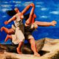
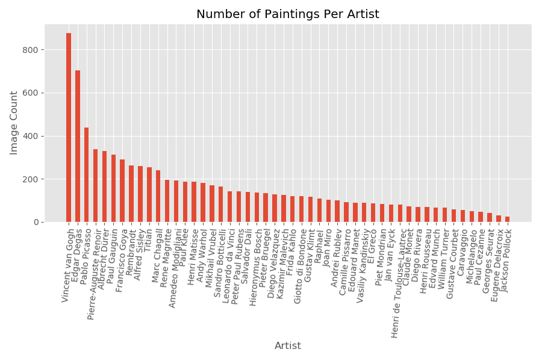
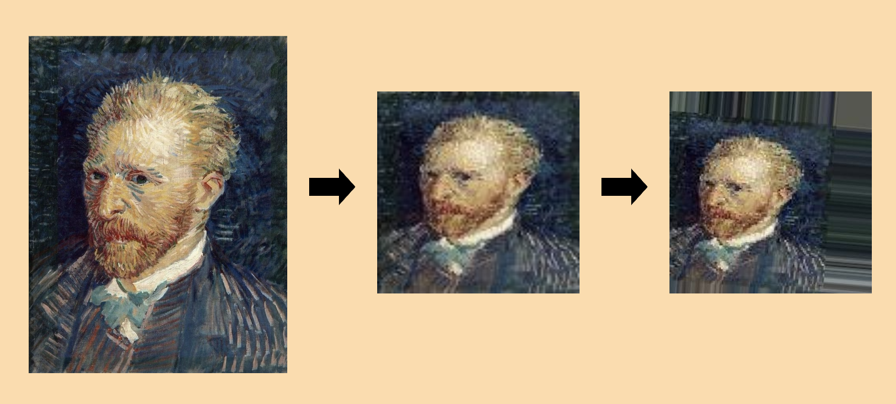
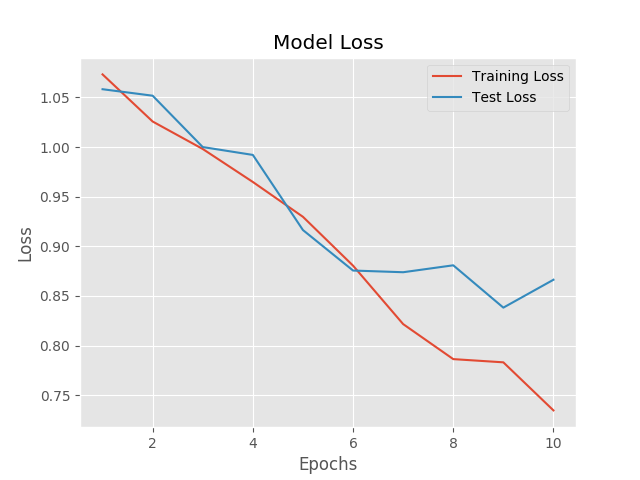
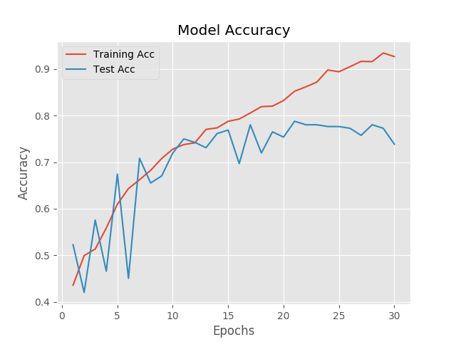
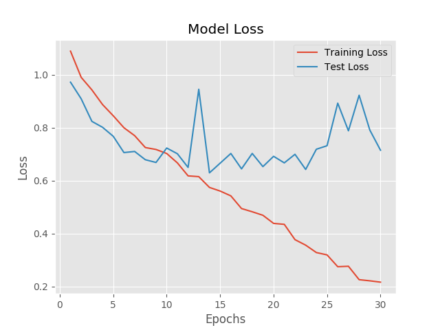
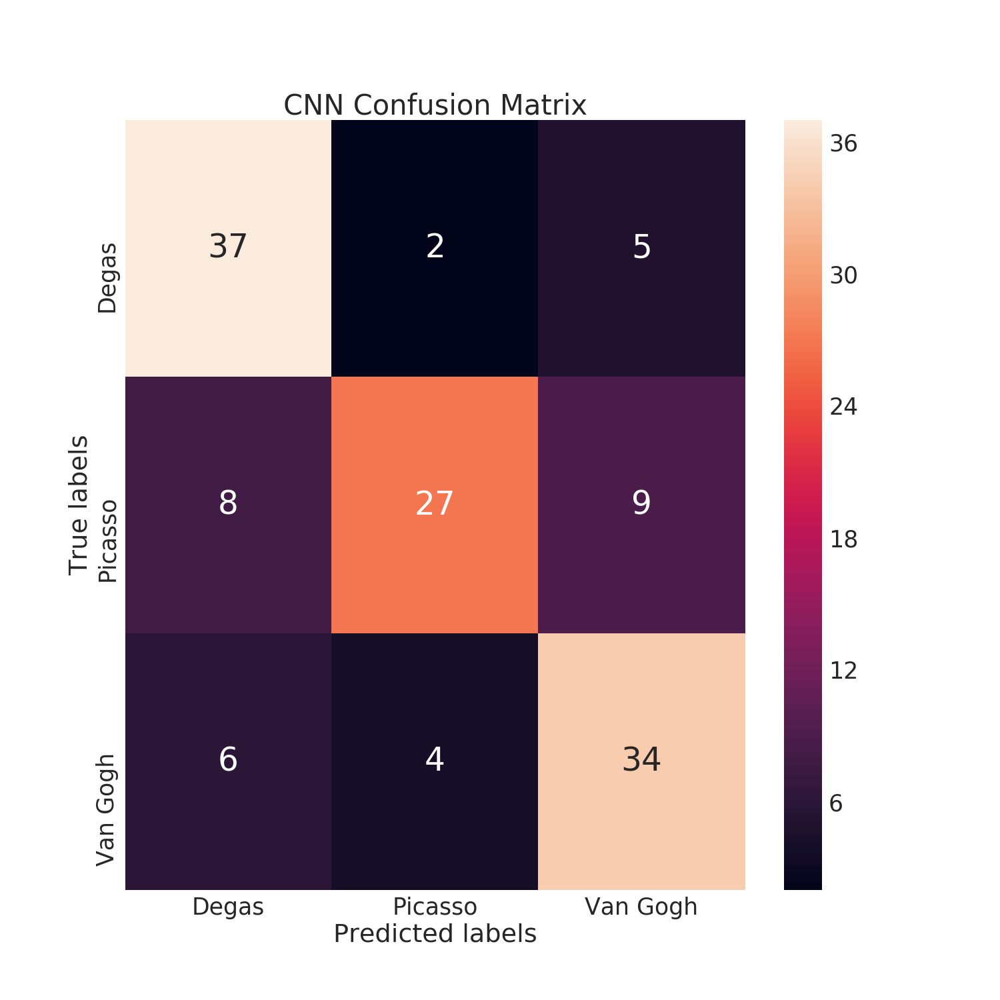
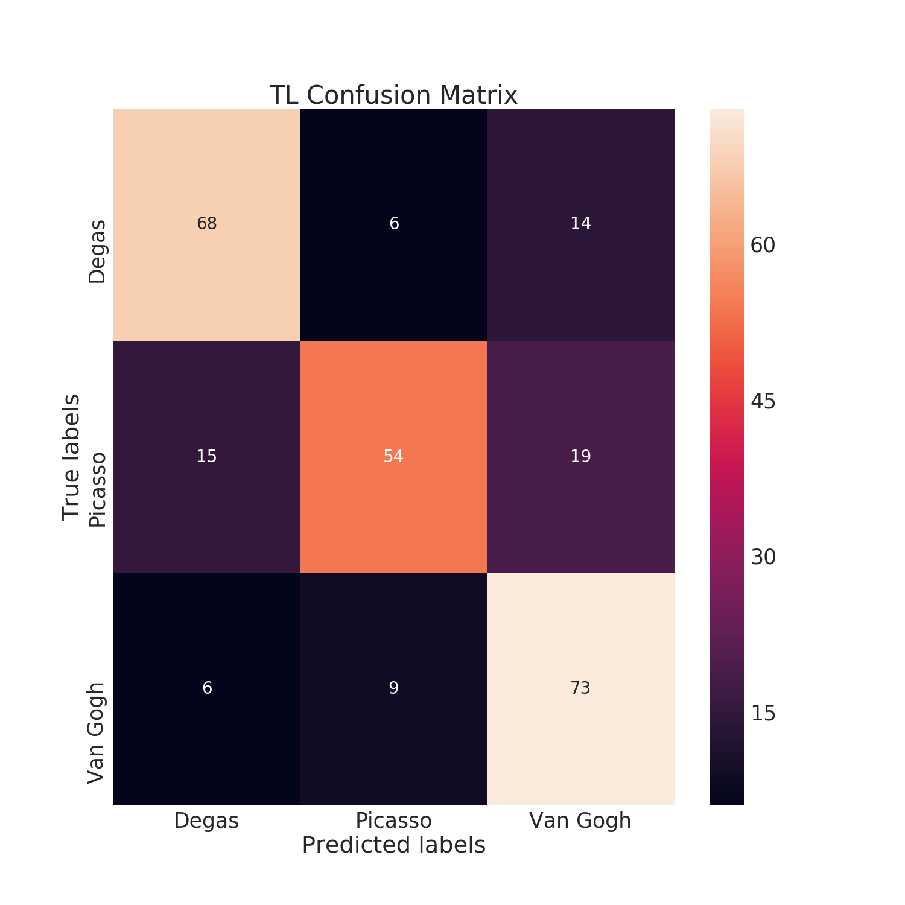

# Who's the Artist?
Image Classification - Convolution Neural Network project 

*By Abel Desta*

    

# Introduction
My capstone idea is to build a image classifier using a Convolution Neural Network to classify which artist made the painting. 

        Tools: [Python, Pandas, Numpy, Sci-kit Image, Tensorflow Keras, AWS EC2]

## Data
I found a dataset on kaggle which contains most of the artwork from the 50 influential artist ranging from everytime period. The data came with a csv file that contained information about each artist, such as a small bio, genre and nationality of the artist. The artwork was scraped from [artchallenge](http://artchallenge.ru/?lang=en) website. 

There is around 8500 images scaped. All the images in the files are RGB images in JPG format. RGB images are represented as 3D matrices. The rows and columns give us the number of pixels in each dimension. The more pixels, the larger the matrix. The depth gives a 2D matrix with the pixel intensity of each color (Red, Green, and Blue) at each pixel. Values range from 0 to 255.

The images came resized but still high resolution. Also, most images came in a various different pixel size and shape.

    
    

## Goal
My goal for this capstone is to build a convolution neural network to be able to take an image of artists' artwork and classify the piece to the correct artists. To start, I will try to correctly classify the three artists out the 50 in the dataset. Since my computer would be very slow to train CNNs. I decided to run a gpu instance that would be able to train on CNNs much better, p2.xlarge instance.

## EDA
There are 31 different genres in the dataset. Some artists belonged in more than one genre.

|Genres |  Number of Artists|Genres |  Number of Artists|
|--------|----------------|------------|--------|      
|Northern Renaissance|  4| Post-Impressionism   |  4|
|Impressionism        |    4| Baroque    |   4|
 Romanticism|     3| High Renaissance     |                      3|
 Surrealism|      2|Primitivism |    2|
|Impressionism,Post-Impressionism|           2| Early Renaissance |  1|
|Symbolism,Art Nouveau |                     1| Symbolism     |  1|
|Realism                 |       1| Social Realism,Muralism  |   1|
|Pop Art      |                 1| Neoplasticism            |    1|
|Expressionism,Abstractionism,Surrealism|    1| Symbolism,Expressionism   |    1|
|High Renaissance,Mannerism |   1| Surrealism,Impressionism    |               1|
|Cubism        |  1|Suprematism                   |             1|
|Realism,Impressionism        |              1| Expressionism   |        1|
|Symbolism,Post-Impressionism |             1 | Abstract Expressionism |            1|
|Mannerism                    |           1| Primitivism,Surrealism       |        1|
|Expressionism,Abstractionism |              1| Byzantine Art                |      1|
|Proto Renaissance    |                  1|

**Table 1. The number of artist in each genre.**

The number of paintings from each artist varied greatly. Which might come from artist productivity or from difficult finding an artists artwork when the data was collected. Since my goal is to classify artist based on images, the class imbalances will be a problem that needs to be handled. 

    

**Figure 1. This bar chart shows severe discrepancy in images for artists.**

# Building the Artist CNN

## Pipeline 

An issue I had to fix in the pipline was resizing because the images varied in pixel size and shape. So the pipeline would take in a folder of an artists images and resize all the image to the desired shape, which in this case was 100 x 100 x 3. Then to increase number of images the cnn would train on it would take those images and create 10 augmented images per image. 

For my model, I decided to classify three artists to start. I picked three artists with the most images in the dataset, Vincent Van Gogh, Edagr Degas, and Pablo Picasso. 

### Pipeline Flow

    

**Figure 2. The pipeline process.**

## CNN 
| Layers | Output Shape | # Parameter |
|--------|--------------|-------------|
| Convolution Layer | 98 x 98 x 32 | 896 |
| Convolution Layer | 96 x 96 x 32 | 9248 |
| Max Pool | 48 x 48 x 32 | 0 |
| Convolution Layer | 46 x 46 x 64 | 18496 |
| Convolution Layer | 44 x 44 x 64 | 36928 |
| Max Pool | 22 x 22 x 64 | 0 |
| Convolution Layer | 20 x 20 x 96| 55392 |
| Convolution Layer | 18 x 18 x 96| 83040 |
| Max Pool | 9 x 9 x 96 | 0 |
| Flatten | 7776 | 0 |
| Dense | 128 | 995456 |
| 60% Dropout | 128 | 0 |
| Dense | 3 | 387 |

* Input Image resolution: 250 x 250 x 3
* Trained on 1842 images
* Total Parameters: 1,199,843

# Transfer Learning 

After learning about Transfer Learning which leverages knowledge from a model, used to solve a problem unrelated or related to another, to solve a different problem. I wanted to determine if a transfer learning model could outperform by my CNN built from stratch. I decided to go with a feature extraction approach using Keras' Xception model. 

So, I removed the head of the model and used Xception's pretrained weight to featurize my images into a array. Then, I would be able to take those featurized 1D arrays and train a Random Forest and Gradient Boosted model to determine which model is better.

# Results 
### Initial CNN Results

    
    

In my inital results, I ran the images on a 4 convolution layer model with no dropout. You can see that this model overfitted to the training set based on the large descrepancy in and loss, which can indicate the model could be too complex.

### Some Improvement

    
    

In this model, you see the results are much better than my first model. This iteration od my model 3 convolution layers with low dropout. This interation of my model was only able to get up to 70 percent accuracy on the training set and 65 percent accuracy on the test. 

### Final CNN model 

    
    

My final model is mostly the same as the previous, 3 convolution layer, but this time I increased the dropout from .3 to .8 and doubled the number of filters in the last convolution layer. I trained the model for 50 epochs. If you look at the model accuracy and loss at the 10th epoch, the training accuracy and test accuracy are 76 and 74 percent, respectively. From that perspective the model performed better but not by as much as I expected and we start to see that the model overfit to the training set as the epochs increase.

| Holdout metrics | My CNN | TL |
|-----------------|--------|----|
| Accuracy | 70% | 74% |
| Precision | 72% | 75% |
| Recall | 69% | 74% |

    
    

## Future Work

* Better treatment for imbalance classes and/or try 3 artists with relative the same amount of images 
* Work more on the model architeture and tuning
* After achieving good score on 3 artists, start adding artists, i.e. increase classes.
